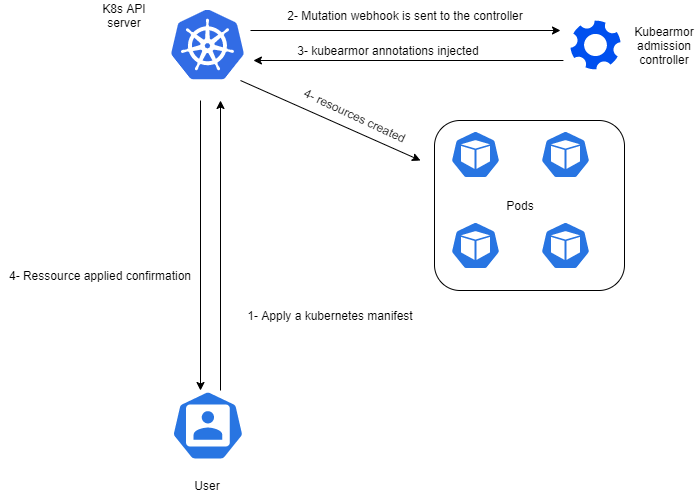

# Mutation controller

## Context

We aim to decople all annotation related code from kubearmor and delegate the annotation process to an admission controller.

## How pods can be created on a K8S cluster?

Pod can be create via:

- Deployment
- ReplicaSet
- StatefulSet
- CronJob
- Job
- Directly via pod manifest (imperative creation)
- Staticly([Static pods](https://kubernetes.io/docs/tasks/configure-pod-container/static-pod/))

## Expected behavior

When the admission controller receives a mutation  webhook from the API server, the admission controller should check if the pod contains annotaions or not.

if it is already annotated, no further action is required.

if its not, the admission controller should perform parent detection logic to determine the origin resource that caused the pod to be created and annotate it with kubearmor annotations.

In order to acheive this, we need to refactor the `WatchK8sPods` function into an admission controller, in addition we need to create patch logic for indicidual pods (static, created imperativiely), StatefullSets, ... . 

The patch logic can be devided into two main categories.

- Pod patch logic: under `metadata.annotations`

- PodGenerators (Deployment, ReplicaSet, ...) patch logic: under `spec.template.metadata.annotations`, for this we can repourpose the already existant code of Deployment patch e.g. `PatchDeploymentWithAppArmorAnnotations`. The repourpose is made possible here as all "PodGenerators" follows the same "Generic Yaml structure".

This method ensures minimal patches being applied to resources.
